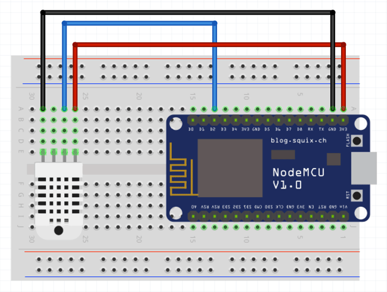
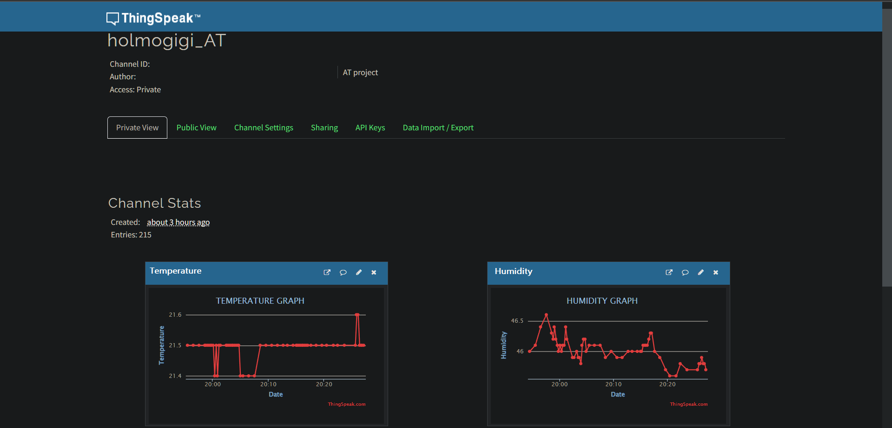

# Project Description

In this project I built a thermometer along with a humidity meter using some simple programming, the hardware parts found below and I'll teach you how to do this too!

# Schematics
1. DHT22 module and NodeMCU schematic:
   

- DAT Pin to D2 pin of NodeMCU (blue wire) **The DAT (Data) pin of the DHT22 module is connected to the D2 pin of the NodeMCU. This is the data line through which the DHT22 sends temperature and humidity data to the NodeMCU** 
- VCC Pin to 5V pin of NodeMCU (red wire) **The VCC (Voltage at the Common Collector) pin of the DHT22 is connected to the 5V pin of the NodeMCU. This provides the power supply to the DHT22 sensor** 
- GND Pin to GND pin of NodeMCU (black wire) **The GND (Ground) pin of the DHT22 is connected to the GND pin of the NodeMCU. This completes the circuit by providing a common reference point for the 5V power supply** 

# Pre-requisites

- Arduino IDE
- ThingSpeak channel
- ESP8266 NodeMCU 1.0 [link](https://docs.platformio.org/en/stable/boards/espressif8266/nodemcuv2.html)
- DHT22 module  [link](https://components101.com/sensors/dht22-pinout-specs-datasheet#:~:text=The%20DHT22%20is%20a%20commonly,to%20interface%20with%20other%20microcontrollers.)
- Jumper wires

# Setup and Build

**1.** Create ThingSpeak channel with 2 fields, one for temperature and one for humidity [link](https://thingspeak.com/). 

**2.** Install Arduino IDE [link](https://downloads.arduino.cc/arduino-ide/nightly/arduino-ide_nightly-latest_Windows_64bit.zip)

**3.** Connect everything as shown in the schematic above

**4.** Connect board to PC with a Micro USB to USB A cable

**5.** Install board driver [link](https://www.pololu.com/file/0J14/pololu-cp2102-windows-220616.zip). After doing this check in **Device Manager -> Ports (COM & LPT)** that **Silicon Labs CP210x USB to UART Bridge** or something similar is present 

**6.** In Arduino IDE open the **code** file 
   
**7.** Install the following libraries (Sketch -> Include library -> Manage Libraries): **DHT sensor library by Adafruit Version 1.4.4** and **ThingSpeak by MathWorks <support@thingspeak.com> Version 2.0.1**

**8.** Open **File -> Preferences** and add https://arduino.esp8266.com/stable/package_esp8266com_index.json in the **Additional Boards Manager URL's**

**9.** Open **Tools -> Board -> Boards Manager** search for esp8266 and install it. Save the changes (**Ctrl+S**).

**10.** Open and select **Tools -> Board -> ESP8266 Boards -> NodeMCU 1.0 (ESP-12E Module)** 

**11.** Open and select **Tools -> Port -> COM3**

**12.** From the ThingSpeak channel take the Write API Key and the Channel ID and put them in **code\credendtials.h**, in WRITE_API_KEY and CHANNEL_ID. SSID should be completed with your own local WiFi name and PASS with your local WiFi password

**13.** Save everything, click **Sketch -> Verify/Compile** and after it succeeds click **Sketch -> Upload** (you could also press the **RST** button on the board if it does not update after the upload)

**14.** **DONE!** if you navigate back to the ThingSpeak channel you should be able to see something similar to this

